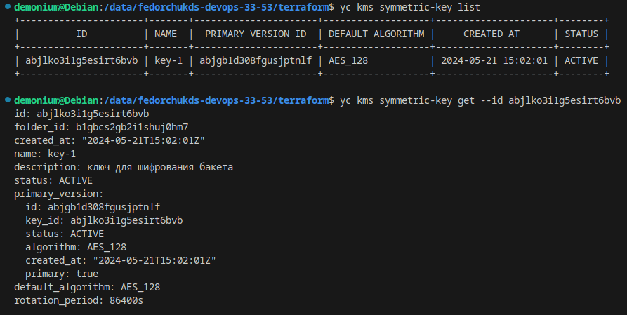
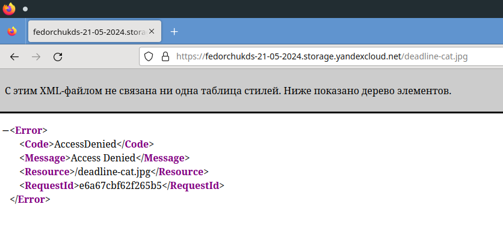
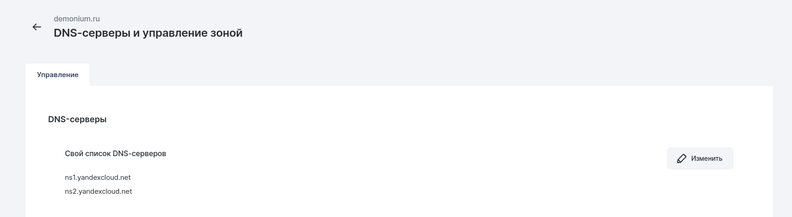
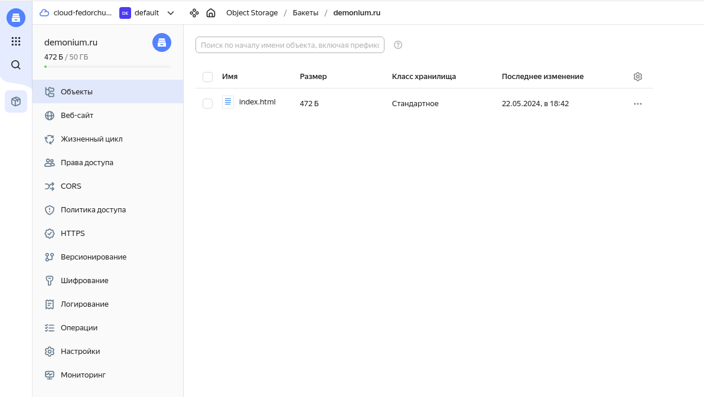
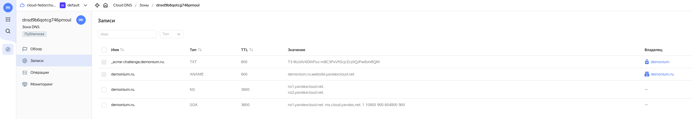
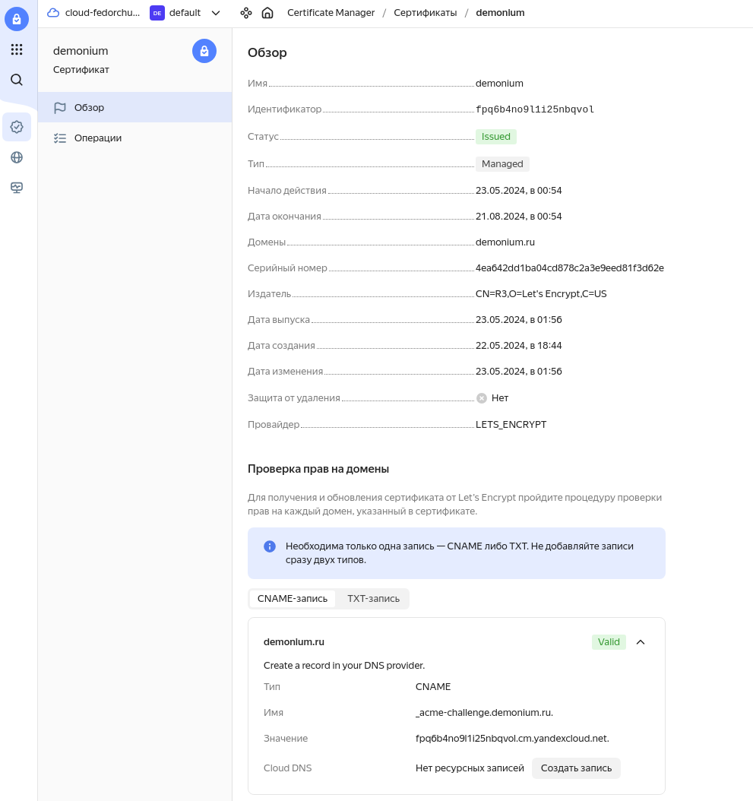
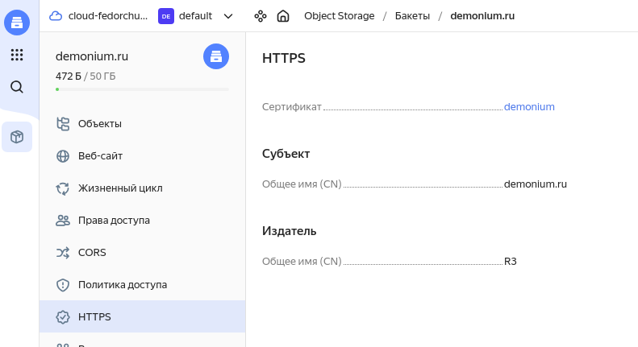
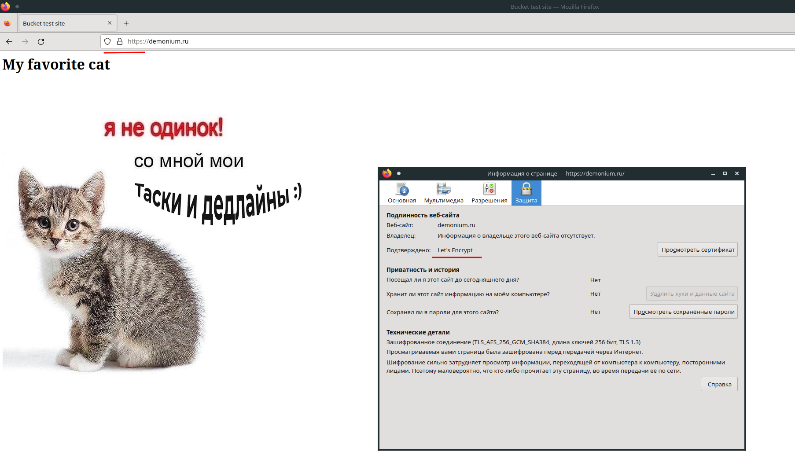

# Автор: Федорчук Дмитрий Сергеевич DEVOPS-33

# Домашнее задание к занятию «Безопасность в облачных провайдерах»

Используя конфигурации, выполненные в рамках предыдущих домашних заданий, нужно добавить возможность шифрования бакета.

---
## Задание 1. Yandex Cloud

1. С помощью ключа в KMS необходимо зашифровать содержимое бакета:

 - создать ключ в KMS;
 - с помощью ключа зашифровать содержимое бакета, созданного ранее.
2. (Выполняется не в Terraform)* Создать статический сайт в Object Storage c собственным публичным адресом и сделать доступным по HTTPS:

 - создать сертификат;
 - создать статическую страницу в Object Storage и применить сертификат HTTPS;
 - в качестве результата предоставить скриншот на страницу с сертификатом в заголовке (замочек).

Полезные документы:

- [Настройка HTTPS статичного сайта](https://cloud.yandex.ru/docs/storage/operations/hosting/certificate).
- [Object Storage bucket](https://registry.terraform.io/providers/yandex-cloud/yandex/latest/docs/resources/storage_bucket).
- [KMS key](https://registry.terraform.io/providers/yandex-cloud/yandex/latest/docs/resources/kms_symmetric_key).

--- 

## Выполнение задания 1. Yandex Cloud

1. Для выполнения задания буду использовать код Terraform выполненный в прошлом задании, т.к. в нем уже есть бакет и загрузка изображения в него.

Создаю роль для службы KMS, которая даст возможность зашифровывать и расшифровывать данные:

```
resource "yandex_resourcemanager_folder_iam_member" "sa-editor-encrypter-decrypter" {
  folder_id = var.folder_id
  role      = "kms.keys.encrypterDecrypter"
  member    = "serviceAccount:${yandex_iam_service_account.service.id}"
}
```

Создаю симметричный ключ шифрования с алгоритмом шифрования AES_128 и временем жизни 24 часа:

```
resource "yandex_kms_symmetric_key" "secret-key" {
  name              = "key-1"
  description       = "ключ для шифрования бакета"
  default_algorithm = "AES_128"
  rotation_period   = "24h"
}
```

Применяю ключ шифрования к созданному ранее бакету:

```
  server_side_encryption_configuration {
    rule {
      apply_server_side_encryption_by_default {
        kms_master_key_id = yandex_kms_symmetric_key.secret-key.id
        sse_algorithm     = "aws:kms"
      }
    }
  }
```

После применения кода Terraform проверю результат:



Ключ шифрования создан.

Открою зашифрованный файл в браузере:



Доступа к файлу в бакете нет, т.к. он зашифрован.

2. Для выполнения этого задания зарегистрирую свой домен и укажу NS записи ссылающие на NS yandexcloud.net:



Создаю новый бакет загружаю в него индексную страницу:



Создаю запрос на сертификат Let's Encrypt и DNS запись для подтверждения подлинности сайта:



Через некоторое время после проверки подлинности сайта сертификат становится валидным:



Включаю HTTPS для сайта, привязав к нему созданный сертификат:



Проверю результат, открыв сайт в браузере:



Сайт открывается. Видно, что шифрование обеспечивается сертификатом Let's Encrypt.